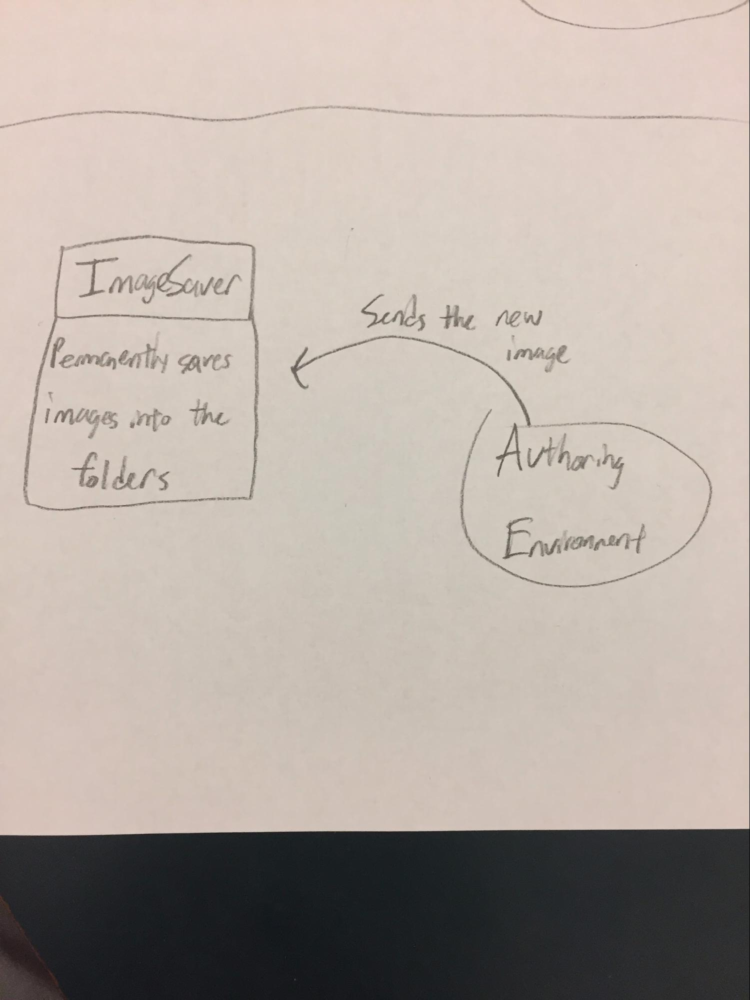
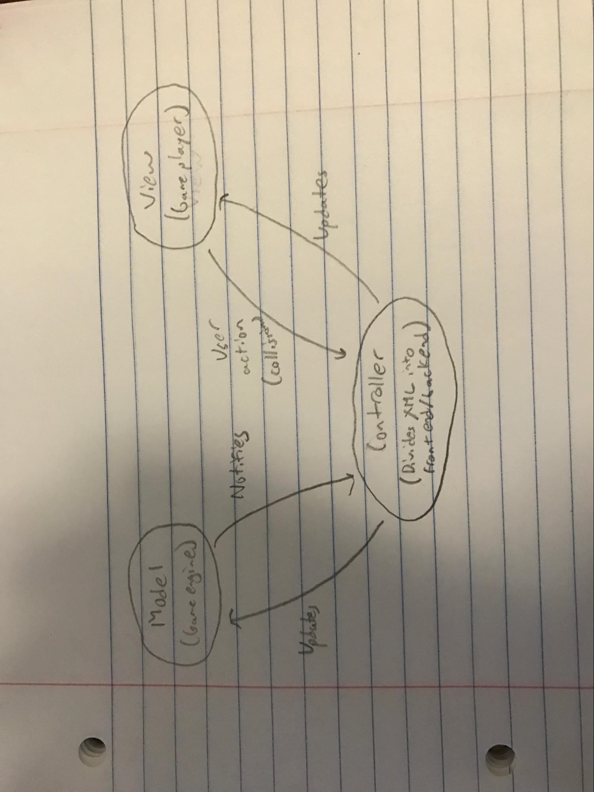
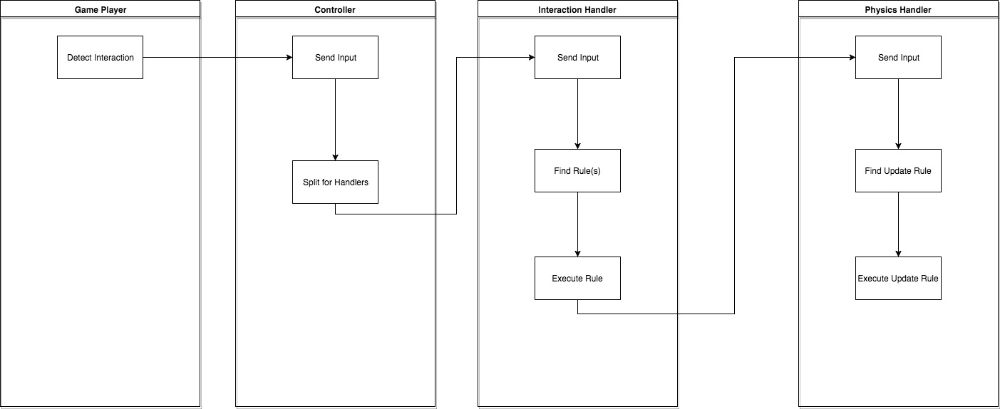
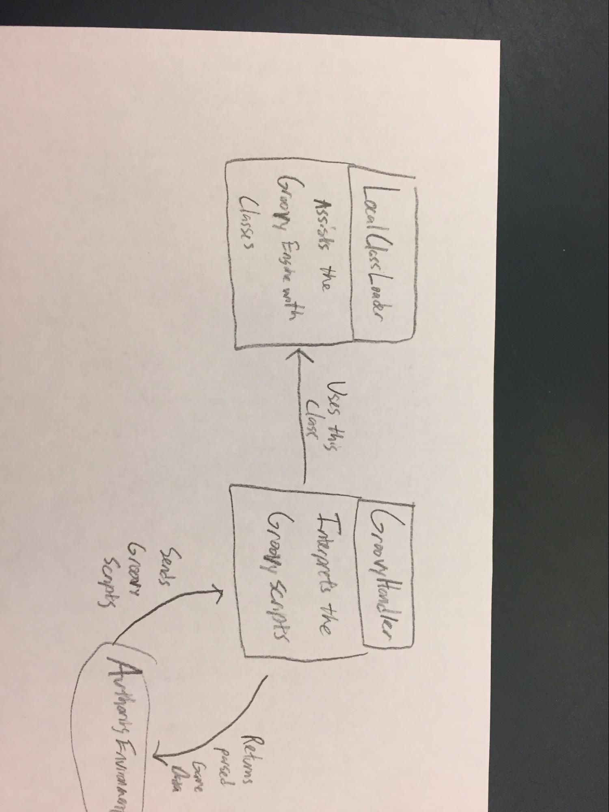
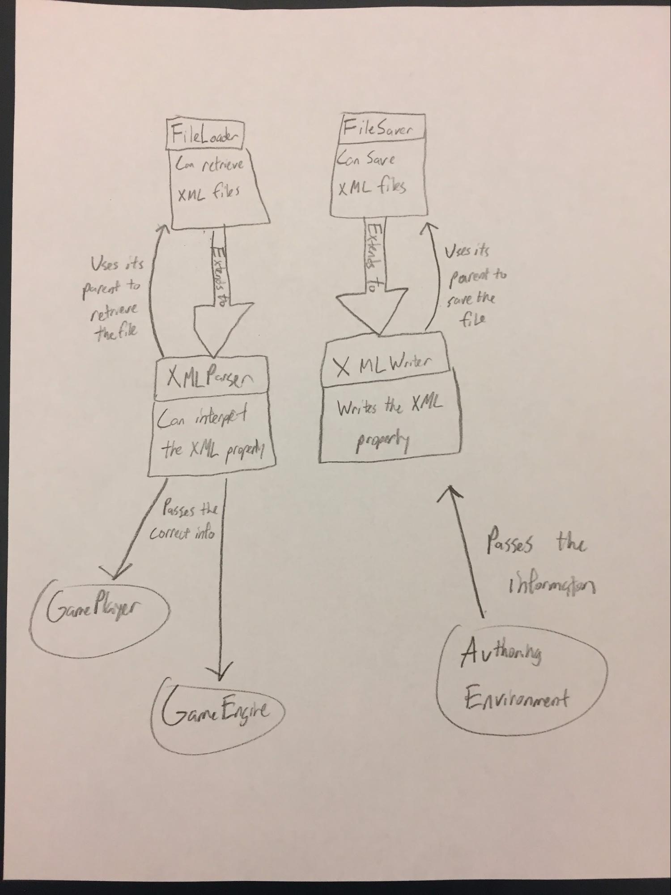

# Team Raindrop Design

## Introduction
We aim to create a game authoring environment that provides flexibility in creating platform based games as well as other game structures. In order to accomplish this, we intend to have features in our authoring environment that are very flexible and allow a wide range of customization. Additionally, in order to have our program design be flexible, we intend to separate the project into three teams, which each will create independent components. The game authoring environment will create a representation of a game, saved as xml data, which can be interpreted by any game engine. The game engine will be able to take in a variety of data forms and convert them into a usable model which runs various games. Finally, the game player will be able to take in position and movement specifications from a game engine and update the display of the game accordingly. These independent components will work together without being dependent, allowing for our authoring environment to be easily extended and changed. In general, our final product will be closed in terms of class modification, but will allow for various sub-class additions such as new rules, which allows the game to process new events. Additionally, we plan to create a design structure which allows for sub-class addition in all aspects further than just the rules; however, purely for the purpose of creating new types of games we hope that our product will only need rule addition to provide a variety of new features. Other sub-class addition may improve or change the GUI usability or preferences.

## Overview

### Game Player
The game player will consist of three main packages: overall control of gameflow, moving UI elements and interpreting data files. The game player serves an elaborate controller for the project in an encompassing MVC design, as well as the portion of the front end that deals with real-time game changes. 
The controller will bring up a splash screen, which allows the user to load a game data, provided by the data developer, or start a new game, which will again load a game data, with initial (or start design), i.e. the actor is at the far left of the screen and no enemies or other objects have been destroyed.

When the XML file is read the relevant data will be converted into data relevant to the front end (game player cont.) and data relevant to the back end (game engine). In game player, we will likely have a controller class which first interprets the XML file using a created “Interpreter” object. The Interpreter will divide the provided XML file data into what the front end requires and what the back end requires. The controller will then instantiate the view (game player) and model (game engine), passing each its relevant data. The game player will receive a list of the objects which populate the game screen. Each object will have a file path to retrieve an ImageView to represent its visual appearance, height and width, its location (x and y coordinates), movement characteristics, a collidable boolean and type id. The data will be brought in from the game authoring environment, which has organized the screen’s data into a 2D-array like List format. 

Whenever a collision occurs, the front end and back end will also interact. Whenever a collision occurs, the portion of gameplayer which controls gameflow will call an event handler method on the physics engine which will employ a Factory-like design to determine what type of collision occurs. The method will take a created “Config” object--UIImageProperties--that will contain all necessary information, as well as a List of all other objects, to determine what results from the collision, e.g. explosion, change in direction, change of ImageView, etc. Once the change is administered in the back end, the new information will be passed to the game player, specifically UIView, in the form of a List, which represents the entire screen. Additionally, the game player will contain a “Physics Engine” which determines the movement followed by objects when user input is provided; however, interaction between the front end and the back end for that part will only to the extent that the collision reaction given to the front end from the event handler requires animation.

Below is a picture showing the MVC design with which the game player interacts with data and game engine:

The second module has only the classes mentioned which are not in hierarchy, although LocalClassLoader does extend the already built GroovyClassLoader. These two classes allow the Authoring Environment to accept the user to write Groovy scripts and to not have to design everything by hand. The GroovyHandler is sent the scripts with the method interpretGroovy(String script, Game g) where the String is interpreted using the scripting engine and implemented back into the game. This module then can save what was written in the scripts using the first module and have it included when sent to the back end. The following is a drawing of what it looks like modeled visually:

The final module is the ImageSaver module which is a single class which allows the user to put a new image into the images folder from the Authoring environment. This is simply sent a new image with the method saveImage(Image i) and this image is then saved forever in the files. The following is a drawing of what it looks like modeled visually:

### Game Engine
The Game Engine is split into two major parts: the Interaction Handler and the Physics Handler. The reason for this binary split is that the only thing that will cause changes in the game is some sort of interaction within the game. Interactions in this case represents collisions between sprites on the screen or user input. The Controller that is the medium between the Game Player (view) and Game Engine (model) sends input from the Game Player whenever some interaction happens on screen or is sent in from the user. The Game Engine then takes the input and looks through pre-defined Rules (set in the Game Authoring Environment) to find out which Rule to execute. Then, the Interaction Handler will pass on data about the interaction to the Physics Handler which will change the positions or behaviors of the involved sprites. Since the Game Player’s frontend sprites listen to these backend model sprites, these new attributes and values will be sent immediately to the view, which will display the relevant information changes. These are the basic components of the Game Engine, and this diagram shows how they are related:

The current split into Interaction Handler and Physics Handler will further be subdivided in the future into even more specific handlers like Movement Handler, Key Input Handler, Collision Handler, and a Physics Handler. These handlers will all follow the basic pattern of receiving input, finding the relevant rules, and then executing those rules.

### Authoring Environment
We will use a model-view-controller architecture for the authoring environment. Model will consist of data classes that can store the game state. View will consist of display objects such as TabPanes and GridPanes. Controller will consist of the main GUI class and the XMLReader/Writer.
The main GUI class will be GUIBuilder, which will initialize the other GUI components. There will be four main GUI components: TabView, GridView, MenuView, and ToolbarView. GridView is the display that contains the sprites that the user has placed into the game. The sprites in GridView are selected from the TabView, which will have three tabs that hold characters, map elements, and powerups. We will use UtilityFactory to generate buttons and sliders for the GUI components.
The main way the user interacts with the authoring environment is by dragging sprites from the side panel into the grid. The ImageView objects for the sprites in the side panel will have mouse listeners to detect when the user clicks on them. The user can also open manager windows from the toolbar to perform tasks like set interactions, configure splash screen, and set sprite properties, among others. Three data classes will hold the game state for the authoring environment and be used for saving the state of the authoring environment: GridViewData, TabData, and SplashData. Each sprite will hold a list of rules that specify how it interacts with other sprites, and these rules can be set through the interactions manager. We decided to make the external API of the authoring environment very sparse. The front end will communicate with the backend by passing a data class that holds the game state, and apart from that it won’t have other public methods.

## User Interface

### Authoring Environment
The front end user interface portion of this project will consist of a splash screen, and a GUI with 3 major components: a menu, a tab pane, and a grid pane. The user will first view a splash screen that introduces the rules of the game, and allows the user to select a level size (small, medium, or large). The level size selection will determine the size of the grid pane, and the length of the scroll bars in the game authoring environment. 
The menu component will be at the top of the GUI and include 4 options that are interactive with the designer. The first option, “File” allows the user to save or load their progress into the level design grid pane. When they click save, they can specify a name for their level, and it stores all of the details of their level into an XML file. Loading a file will allow the user to select an XML file, and load the details into the design GUI. The next option, “Graphics”, will allow the designer to customize a few aspects of the graphics of the level. Firstly, they can select “Background” and either select a color, or upload an image that will become the background of the level. Another graphics options is the color scheme, which will determine the general colors used for blocks and objects in the level. For example, grayscale is one color scheme option that will specify the colors of many components of the game. The final menu option, “Set instructions”, contains every customizable value of the level. Examples include point values, lives, game controls, animation speed, camera pan directions, and many more. These values can be customized within a predetermined range. Some of these values are required to be entered before the level is run, and others are optional values. Every value entered is stored into the XML file when saved. 
The Tab Pane allows the user to select a block or object to place in the level. The first tab of the tab pane, “blocks” contains some preset blocks, and then some blocks that can be created and customized by the user. The preset blocks are the blocks that set the boundaries of the level, the blocks that determine where the player dies, and the block that determines where the player wins the level. Additional blocks can be created and customized by the user and added to the list of blocks. Customization includes a color or image for the block, and an interaction between the block and player or enemies. The interactions of the block must be selected from a list of pre-programmed interactions. Those blocks can be clicked on and placed into the level. The next tab pane is objects which allows the user to select one of the predetermined objects to place into the level. Objects have set interactions with the player, but the image of each object and the movement of each object can be customized. Objects include enemies, powerups, and bonus points. There is a button that allows the player to use an item that they have collected, and the effect of using the item can be customized. The last tab pane, other, includes any remaining features that the designer would like to create. Examples include a key that could be collected and then used later to interact with a certain object or block. Once again, the designer can customize graphics and interactions for these sprites. 
The last component of the user interface is the grid pane. The grid pane, at the center of the screen, is where the designer can place the blocks and objects. They can be selected from the tab pane, and then clicking on a node of the grid pane will place the selected sprite at that location. The scroll bars allow the designer to build a very large and extensive level, and customize the size of the level as preferred. Death blocks or unpassable blocks can be used to set boundaries to the level, and win blocks can be used to set goals for the level.
There are no erroneous situations that prevent the user from running the game, because there would always be default values set for each instruction.

## Design Details

### Game Player
For our game player, we will have three main packages, or sub-modules, that will control the main aspects of the Game Player: the overall control of the gameflow, updating the HUD, moving the UI elements (animation, etc.), and interpreting data files. Our three main sub-modules are: ControllerPackage (Controller, XMLInterpreter), ViewPackage (UIView, UIImageModel, UIImageProperties), and PhysicsPackage (PhysicsEngine, Bounce, Gravity). 

The main idea behind the interaction of Game Player is that we want to minimize the interaction it has with other elements of the software, but we also want it to serve as the main controller in a MVC model that coordinates the flow of the program. The way we envision it is that on start, the controller will bring up a splash screen. This allows the user to load a previous game or create their own game. If they choose to create their own game, we will pass control over to the Game Authoring model, which will allow them to create their game, then they return a data file of the game they just created. We will now pass the data file to XMLInterpreter, which will parse the data and pass what is needed to the front end as well as the backend. On the front end side, we want to keep things simple and have a general UIImageModel, which is a wrapper for all UI elements that will be displayed. The interpreter will pass to the UIImageModel all relative information (file path for image, X, Y, FitHeight, FitWidth, movement characteristics, collidable). All the implementations of the actual actions of these elements will be contained on backend. On the backend side, we will create a map of a string (identifying the type of object) to its correct backend model. These will models contain all the details as to the types of interactions each enemy or block has from the datafiles. Once the XMLInterpreter has parsed all relative information, it will pass control to the UIView. 

The UIView will be the view that actually runs the game, updates scores, etc. It will actually use a lot of the aspects from the GUI that is being designed by the Game Authoring environment for the actual game play, with some customizations to allow for scoring, reset, saving, HUD, etc. For the actual game play, depending on what is within the bounds of the screen the UIView will run the elements accordingly. Some characters will have certain movements, or certain reactions to collisions. When the UI receives a collision between two objects, it will check to see if the two objects are collidable (meaning that there is a reaction to the collision). If there is, then it will pass (either through the controller or a listener) a “handleCollision(UIImageProperties collide1, UIImageProperties collide2, List<UIImageProperties> allActive) method to the backend that will then use the correct model to handle the reaction between the two collidables. We also pass the allActive back incase there is another UIImageModel that has a certain reaction to a given collision. The backend will then create any necessary modifications to the UIImageProperties, then return the new file to the front end to use to adjust the objects. 

We will also make a physics engine, which will complement the UI Front end, but not necessarily be constrained to the front end. It will be more of a floating package that can be used by many different elements of the game. But, the essence of the PhysicsEngine (superclass) is to control certain movement behaviors based off of a user-set definition. For instance, if the user wants to make a certain object bounce, it will assign the object bounce, so on a collision, the backend will receive the collision, make the certain adjustments, but use the Bounce subclass of the physics engine to easily create the bouncing motion. Similarly, on the front end, if the user jumps, we will use the physics engine, gravity, to control the physics of the jump. 

We are designing our front end to be as vague as possible to allow for more extendibility, customizations, etc. We will dynamically create the front end to allow customization, creating a vague UIImageModel class, that can accompany any number of elements as long as they provide the correct file path, etc. I think we could easily extend this design to create a log-in screen. We would only need to create additional ‘splash screens’ and add them to the Controller pathway. I think this model of the game player will allow for a lot of flexibility within the program. Having our game authoring model (being separate) and close interaction with the data writer, will make things like saving, etc. much easier.

### Game Data
To reiterate, the three main modules of Game Data are as follows: (1) a module which loads and saves files in XML with capabilities to not only write but also parse the XML (2) a module which handles groovy scripts and can handle changing the game appropriately (3) a module which can save new images to the proper folder.
	The first module does not do much more than what is specified in the Overview and handles the core functionality from the assignment specification. It serves not only to allow the user to save information in between runs of the program but also acts as the main interface between the Authoring Environment and actual playing of the game. This is important as the two are never being used simultaneously and thus must have a way to pass information in an encapsulated way which this module allows. This module does not interact much with other Game Data modules but interacts with all 3 other subgroups of the project in order to pass and load information between them. Without the functionality of this module, nearly no other aspect of the project is usable or testable. With the FileLoader and FileSaver parent classes, we will be able to create more child classes in the future for further extensions as we can use them to save new types of files if need be at that time. This part of the project is extremely flexible while being encapsulated, therefore making it very extensible on future sprints. This module was created to solve the most core and essential problems of the Game Data portion of the project as outlined in the first sprint and encapsulates processes which could be very messy if let open to the rest of the project. Through the creation of this module, the team has an extensible way to handle saving important files which can be accessed by all portions of the program to get the proper material but which does not allow objects to be improperly edited in the wrong places as is the danger on a large group project such as this.
	The second module also pretty much only does what is specified in the Overview and provides a very interesting tool for the authoring environment to utilize. It allows the authoring environment to not only use visual design but also to allow the user to utilize simple and fun scripts. This module utilizes many of the already built in Groovy methods in order to edit the objects present in the game. This module communicates exclusively with the authoring environment and could also be built to handle other types of scripts if that were required in another sprint. This module allows for the encapsulation of this very unique and interesting tool in a portion of the project which already handles very similar issues. This part of the project accomplishes good design through encapsulation and the ability to be abstracted further if other scripting languages were also to be implemented.
	The final module, again, does basically exactly what is specified in Overview (most of the data classes are pretty small and contained. They don’t really have much to them so there isn’t much to unpack underneath). This module would use the images resource folder to save the new images. This module would also, similar to the second module, interact exclusively with the authoring environment. This module itself is not very extensible to other portions of the project, but if a similar design request came up, this module could become a hierarchy with a parent class which would then be extensible to new requests. This part of the project is important as it encapsulates the saving of new images to the Game Data portion as opposed to letting the Authoring Environment handle it which is important to have for good individualized design.
	
### Game Engine
The backend model which, as previously stated, handles all interactions that could occur during the game, will be processed by the GameEngine team. Initially, the backend will receive XML data when the game is loaded which contains a list of every object in the game and what it’s properties are. The GameEngine class will use this data to dynamically create model classes which can handle various events for a single type of object. This will be called when the class is created via its constructor which will take in XML data as its parameter. 
As previously stated, when the UI determines that some interaction is occuring the method, handleCollision(UIImageProperties collide1, UIImageProperties collide2, List<UIImageProperties> allActive) will be called. On the GameEnginer class. This method will utilize the previously created models in the GameEngine class. It will use the CollisionHandler class which was initialized in the GameEngine, and call handleCollision(UIImageProperties collide1, UIImageProperties collide2,List<UIImageProperties> allActive) and change the UIImageProperties appropriately by permuting through each properties object and using the dynamically created models to either change position, movement method, or other properties, such as what it does when the player hits it. 
We aim to limit dependencies between the GameEngine and Authoring Environment by not relying on assumptions on what an object can and cannot do. The data will be serializably stored and we aim to retrieve it in a way that allows us to create a model that can handle any object given that it follows the same structure of data stored from the authoring environment. By this we mean that we will make our code dependent on the Authoring Environment in that each model we make will be based on the assumption that objects have a limited possible actions related to movement, movement based on other events, object creation on event, object affecting on event. Examples of these respectively include, a way to move an enemy back and forth, a way to start enemy movement once a player reaches a certain point, a way to create an powerup when a player hits a block, and a way for a powerup to change a player once it is touched. More fields of object functionality may be added as we consider new variations, but we intend to create the GameEngine so that it can work with any new feature additions in gameplay as long as they relate to one of our pre-determined interaction events. 
Additionally, we aim to limit dependency between the GamePlayer and GameEngine and with this in mind, we hope to not have access to anything in the game other than collision handling. This does however take away much from the original description of what the GameEngine will do. We may restructure teams to have a group working on display of game in between GameEngine and GamePlayer responsibility, but purely based on code, the display of the game and player visuals will be completely separate from what the GameEngine handles.

## Example Games

The game will be able to handle a variety of games including those not expected to follow a platform format due to it being designed in a highly flexible way. Some examples include:

**Super Mario:** Super Mario is the most basic, most famous instance of a platformer. To create Super Mario would be very easy since the user would just need to put down blocks on a map, put a goal block, put some enemies and define their behaviors and put powerups on the map. These objects and sprites will be sent to the Game Player and Game Engine which will handle all interactions between sprites based off their previously-defined rules. Beyond this, there isn’t much involved in a Super Mario game so our engine should be able to handle this.

**Atari Breakout:** Unconventionally, the platform format could be used to create a breakout variant. The player would be the paddle limited to a certain type of movement (left  and right) designated by the rules for key input set in sprite. The platform scroll would be frozen which is data stored in the XML.  The bricks can all have interactive events such as a score update a remove object, change Image, based on our rule inheritance structure. When all blocks are removed a rule causes the goal to be reached jumping level. Finally each object uses the physics engine to create bounding movement. This shows that the general design with rule structure and flexibility on how scrolling occurs allows for basic simple single screen games.

**Doodle Jump:** Doodle Jump involves randomization of structures and blocks and contains a never-ending map. Our design supports this because the Game Authoring Environment will send a signal to the backend that the Game Object to be recreated is a never-ending platformer. Then the Game Engine will dynamically generate elements for the map and update this map as the game progresses. In this way, the never-ending platformer type of game is well supported by our design.

## Design Considerations

### Game Engine
One design consideration we considered is how to deal with every UI object that is going to be on the screen to animate. At first, we thought of having a specific class for every time of object and use reflection to create from the XML file. But, we realized there is really no reason for us to have that many classes. If we have the user set all the details for the block in the game authoring environment, we can pass all those details into a very generic class for each object. This also allows people to easily extend the game to a version they want to play. Since it is just a generic argument, they would only have to set the proper behaviors in the game authoring environment, and it would translate. 

We also considered how we would use our rules which serve as event handlers. Initially, we thought that we would have Sprites contain a list of all their appropriate Rules, and that this Rule class would contain a method which took in a Sprite parameter and modified it appropriately. This creates a backwards dependency that we did not necessarily want. If someone wanted to implement each Gameplay Object as something other than a Sprite but use our EventHandler Rules, they should be able to. In order to accomplish this, we aim to make an abstract Sprite class which has the most general characteristics needed for a Rule to affect it. This would allow extra functionality to be added to a Sprite while still using all our rules. 

The Game Engine aims to be reusable so that any GameAuthoring environment can utilize it as long as it follows the pattern of using our Rules hierarchy and Sprite hierarchy. One issue results from our rules however. In the present design, the GameEngine can only handle certain types of Rules divided into 4 categories specifically, event triggers which can create a object, delete an object, change a characteristic of an object (lives for example), move an object, or adds a new rule to a sprite. This limits the amount of things the game can do significantly but we believe that these characteristics comprehensively define what a platformer should be able to. Without this assumption we would have to find a way to generalize all the things that rules could do which is simply challenging and unrealistic when some rules/event handlers must spontaneously create new objects and return them while others much merely change the location of an existent object. We are open to new ways of representing rules if needed however.