RAINDROP SALAD TUTORIAL

# The Initial Screen

When you launch Raindrop Salad, this should be the first screen you see:

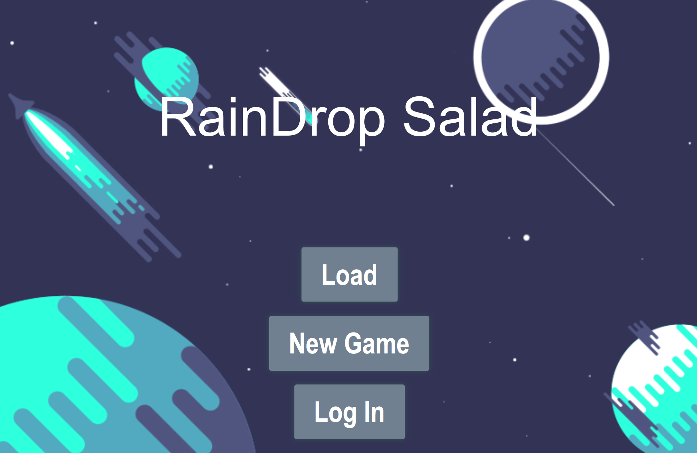

From here, you have 3 options:

1. Load - Open up a pre-existing game to play.

2. New Game - Create a new game to play.

3. Log In - Create a profile to save scores and achievements or log in with Facebook.

We’ll start with the simplest option.

## Logging In

This should be the screen you encounter when you hit "Log In." 

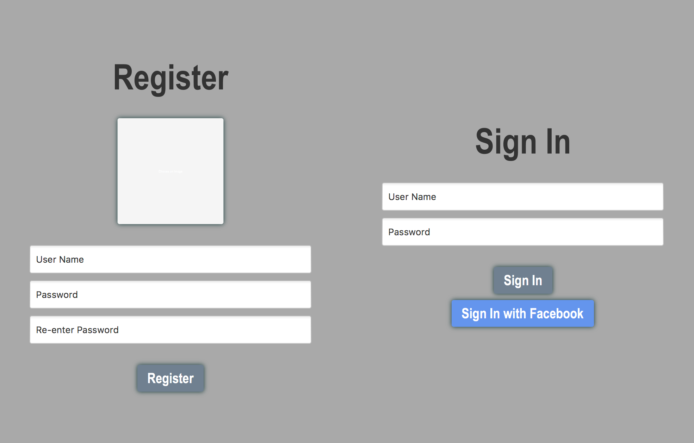

From here, you can register a new profile or you can sign in to an existing profile or you can create/sign in to a profile with Facebook.

Once you created a profile, you can access the profile from the main screen. Your profile will look like this:

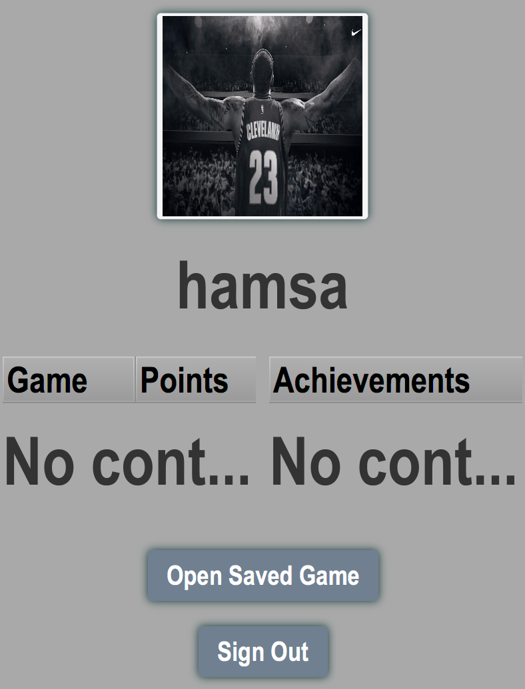

Once you have played a game and saved it, that game and the points and achievements will show up on this screen. You can also open up any saved game from this screen.

## Loading A Game:

If you click on "Load Game", you will be directed to a file chooser in which you choose which game to play, as seen below:

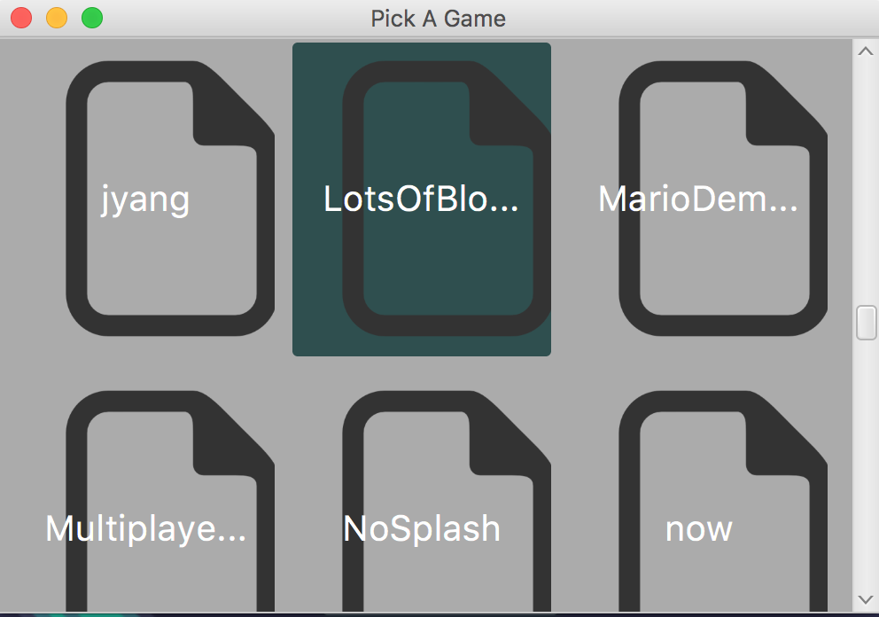

Once you double-click and choose a game, that game’s load screen and instructions will pop up:

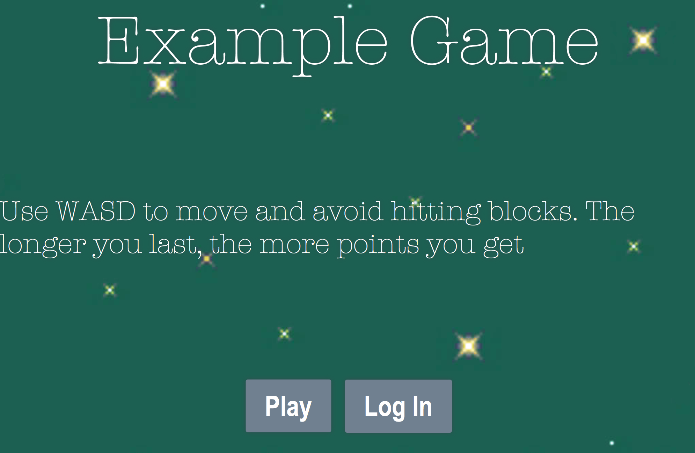

From here, you just need to hit play. Additionally, you could just log in to your profile as well.

This is an example of the screen that will pop up when you hit "Play":

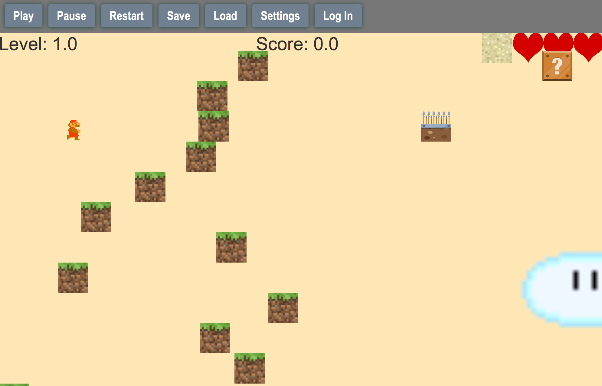

These are what each button on the top does:

* Play - Starts or unpauses the game

* Pause - Stops/pauses the game

    * **Special:** when you pause the game, you can **rewind the game 10 seconds into the past**. So if you screw up, you have an easy redo.

* Restart - Restarts the game

* Save - Saves your current progress to a new file

* Load - Loads a new game from a file

* Settings - Allows for toggling on/off of some basic settings:

    * Lives

    * Level

    * Score

IF you win (big emphasis on the IF), you will get a endgame splash screen that looks something like this:

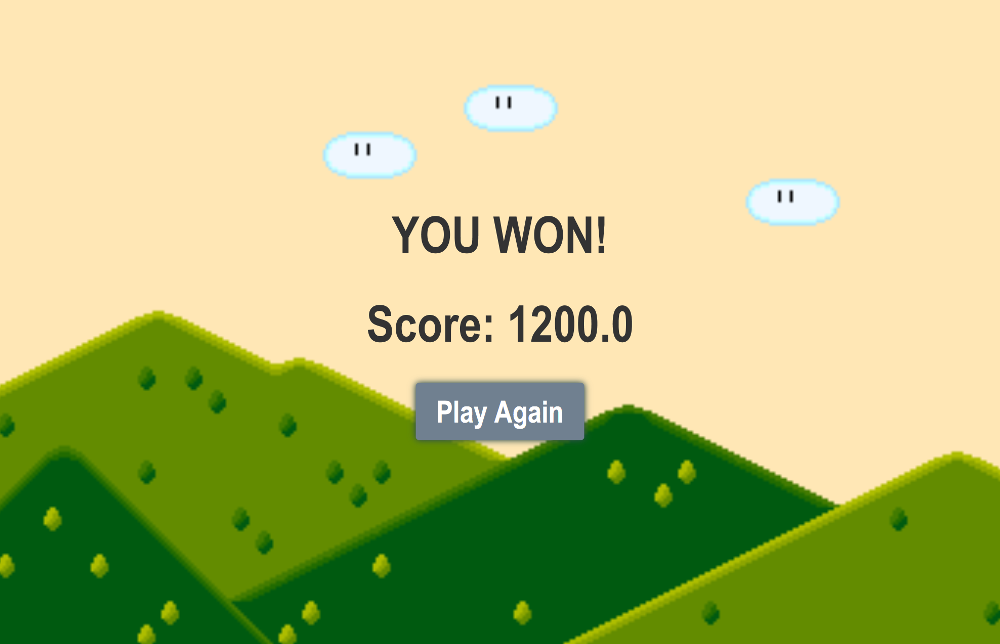

If you die, a similar screen will pop up saying "Game Over." I’m sure you’ll be seeing a lot of that.

Now, onto the most complicated procedure...

## Creating a New Game:

Clicking on "New Game" from the original screen will take you to the game authoring environment:

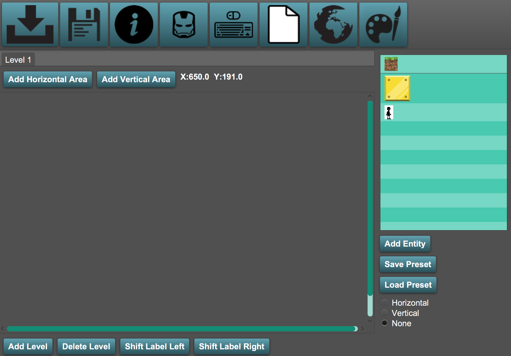

All the buttons on the top row will show their specific function in a tooltip if you hover over them. 

From here, the first thing to do is add new entities. You can either create a new entity or choose from a list of presets:

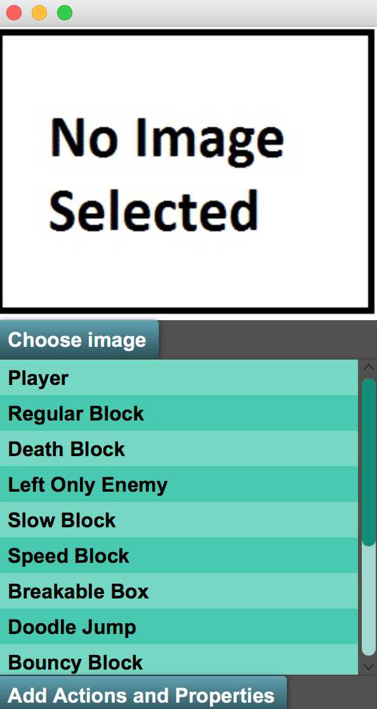

After selecting an image for the entity, you can then add actions and properties to the entity:

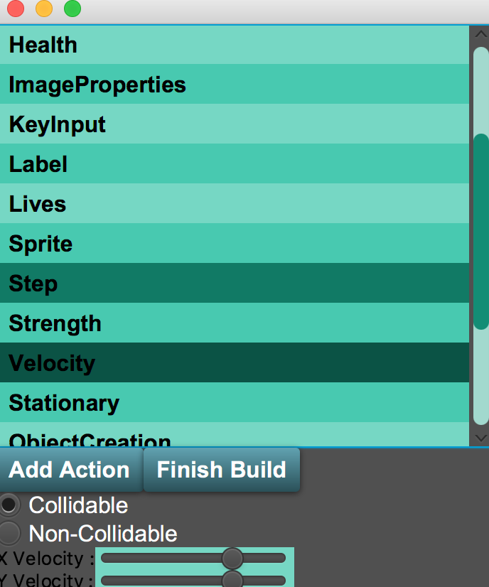

As you can see, components can have values if they need them. 

After that, you will want to add actions to the entity.

An action is the effect that happens when another entity (of a certain type or with a certain label) collides with the currently-created entity.

The screen for actions looks like this:

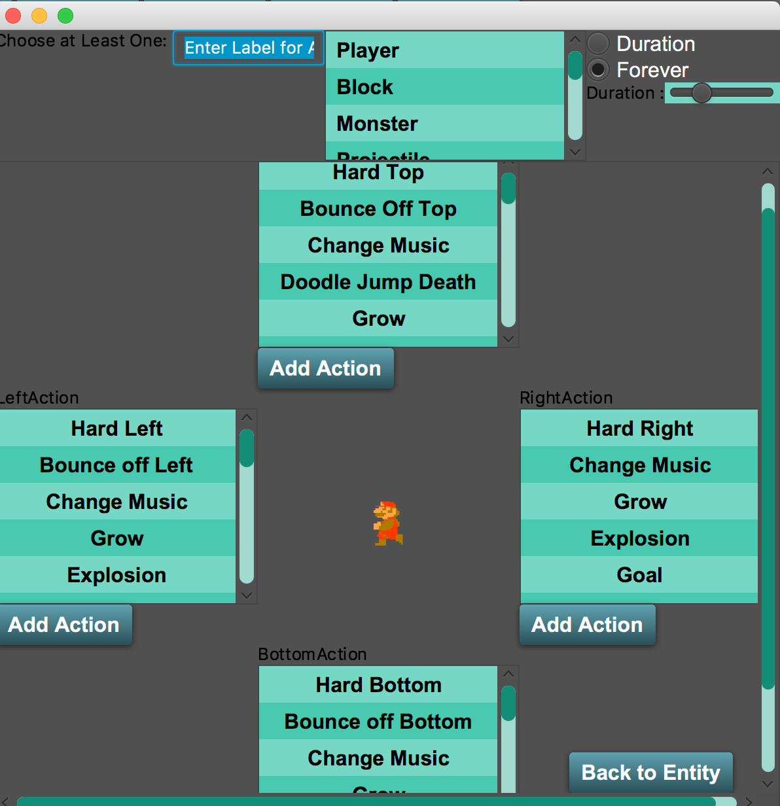

The process here is to EITHER enter a label you want to target OR a entity type that you want to target. It’s like HTML: entity types are like tags and labels are like classes or ids. 

What’s really cool about this is that you can make a block react to different types in different ways. As an example, you could make a block freeze all enemies except for one particular one. To do this, you would select Enemy in the dropdown at the top and specify freeze actions. Then you would put in the label that you have already/will assign to the one enemy you want to survive. Then you would add different actions (or none at all) for that.

After selecting an entity type OR label, you should choose an action for each side of the block that you want collisions on. Some actions will not require any parameters. For these, you just click on add action. For some other actions, parameters are necessary. For these, you want to enter in values as specified by the box that pops up.  When you click on an action, a little gif will pop up showing you what the action does:

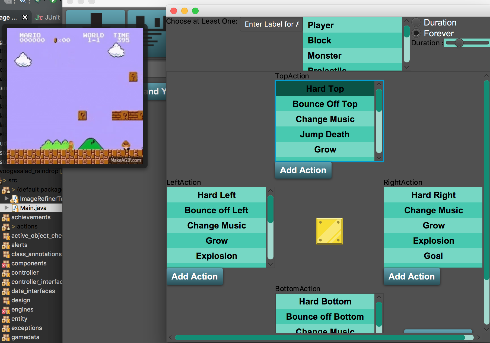

After adding your desired actions, you click "Back to Entity." From here you can add more components or create the entity.

After creating the entity, you will be able to select it from the right hand menu and click anywhere on the screen to place an entity. 

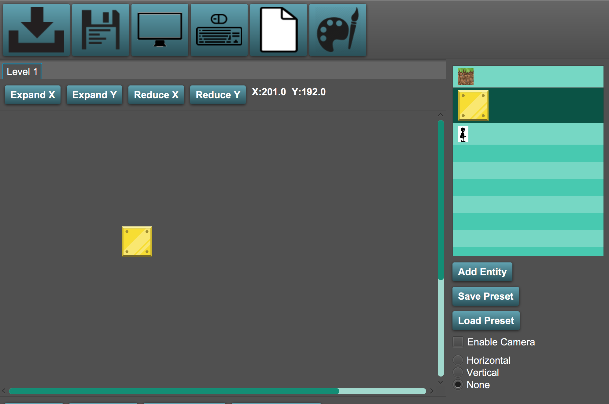

* If you want to change the entity’s position, hold Ctrl and drag the block around.

* If you want to resize the entity, hold alt (on Mac, shift + option) and move the mouse.

* If you want to remove, copy, or edit the entity, right-click on the block.

Entities snap to a hidden grid to allow easy placement of blocks.

Once you create an entity, you can save that as a preset, which you can then later load.

You can load presets from any game.

***For a player entity, you will want to give it special components:**

1. A player entity needs a KeyInput component: when you click on it, two choice will appear at the bottom, Hero and Non-playable. Select Hero if you want to control the character and Non-playable otherwise. A window will then pop up. You will want to select the Up action, hit the key on the keyboard that you want to cause the player to jump, and then hit add. You should do this step for each key input action. Then, hit close.

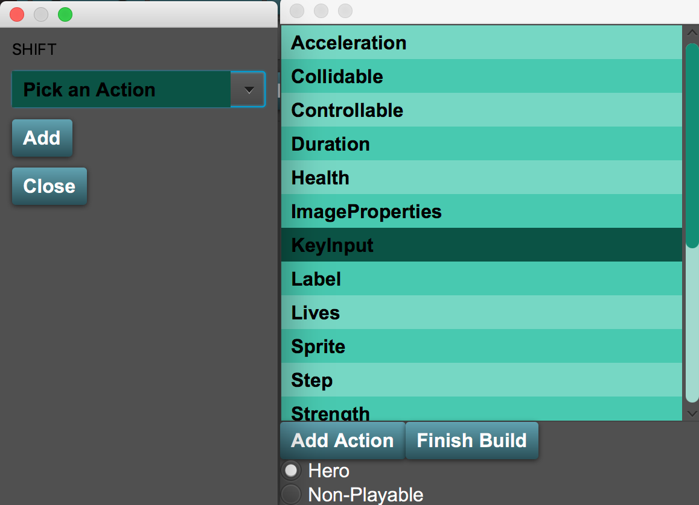

2. A player also needs a velocity component (which dictates how much it will move even if no keys are pressed). You can set this to any value we like (but we recommend 0).

3. A player also needs a Terminal Velocity component so that your player doesn’t zoom off the screen at the speed of light. Also, add a Friction component in there while you’re at it. It’ll make your game look way more realistic.

You can now add all your entities in exactly the way you want them. If you want the game area to be bigger, you can hit Expand X or Expand Y to achieve this, and vice versa with Reduce.

If you want to add levels, click on Add Level, and vice versa with Delete Level.

Switch Labels changes between levels.

Okay, so you’ve finished placing all your entities and you know your game is going to be absolutely sick. Let’s crack this thing open and play it!

WAIT. There are still a few things left to do if you want your game to be REALLY awesome.

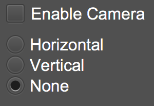

You should see the above items in the bottom right of the authoring environment.

1. Decide if you want to have the camera track the main player. If you made a ping-pong game, you might not want this. But if you made a Super Mario Bros game, you probably want this.

2. Choose if you want to have an infinite platformer. If you don’t, click None. If you *do* want an infinite platformer, decide if you want a vertical platformer (like Doodlejump) or horizontal platformer (like Flappybird). 

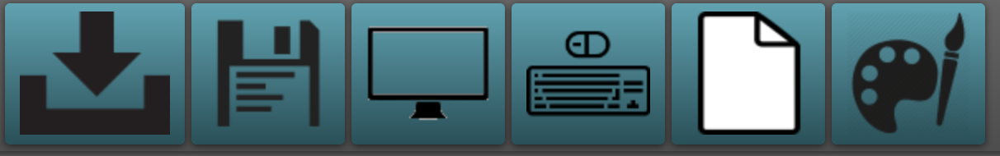

3. At the top, you should see the above row of images. 

    1. The first image loads an already-existing game so that you can edit it

    2. The second saves your current game with a name you provide

    3. The third sets a background for your level

    4. The fourth sets a splashscreen for the game on which you can specify instructions

    5. The fifth removes all elements in case you want to restart your game creation

    6. The 6th is a **SPECIAL** tool that you can use to create your own images to use in your game.

4. So, you should probably add a background and a splash screen. Then you can go ahead and save your level.

You should then be able to play it as mentioned above!

## Have fun and enjoy Raindrop Salad!

